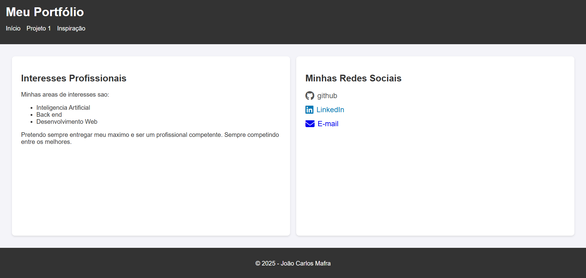
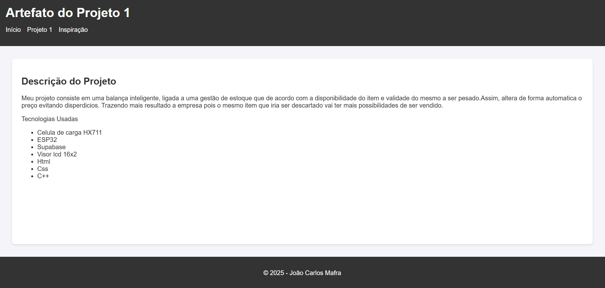
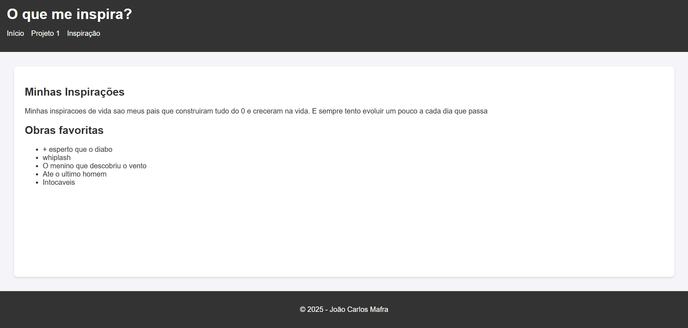

# Portfólio Pessoal

Este é meu site de portfólio desenvolvido como parte da **Entrega Avaliativa da 2ª Unidade** da disciplina de Introdução à Computação.

## Objetivo
Apresentar meus interesses profissionais, projetos desenvolvidos e inspirações, além de disponibilizar minhas redes sociais para contato.

## Tecnologias Utilizadas
- **HTML5** → Estrutura das páginas
- **CSS3 (Flexbox)** → Layout responsivo e estilização
- **JavaScript** → Funções de interatividade

## Estrutura do Projeto
```text
portfolio/
├── imagens/
│   ├── inicio.png
│   ├── inspiracao.png
│   └── projeto1.png
├── index.html
├── projeto1.html
├── inspiracao.html
├── style.css
└── script.js
```

## Funcionalidades
- Layout responsivo usando **Flexbox**
- Navegação simples entre páginas
- Exibição de **interesses profissionais**
- Página dedicada ao **Projeto 1**
- Página sobre **inspirações pessoais**
- Links para **GitHub, LinkedIn e E-mail**
- Função em JavaScript para interação inicial

## Demonstração
- setor **inicio**

- setor **projeto 1**

- setor **inspiracao**

##  Contatos
- [GitHub](https://github.com/joaomafraa)
- [LinkedIn](https://www.linkedin.com/in/joaoc-mafra/)
- [Email](mailto:jcmsn@cesar.school)

## Licença
Este projeto foi desenvolvido para fins acadêmicos e pessoais.  
Você pode utilizar como referência para seus próprios estudos.

